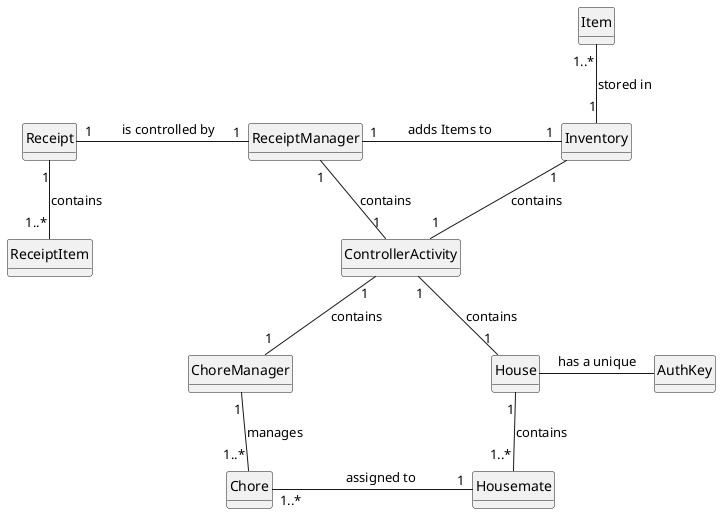
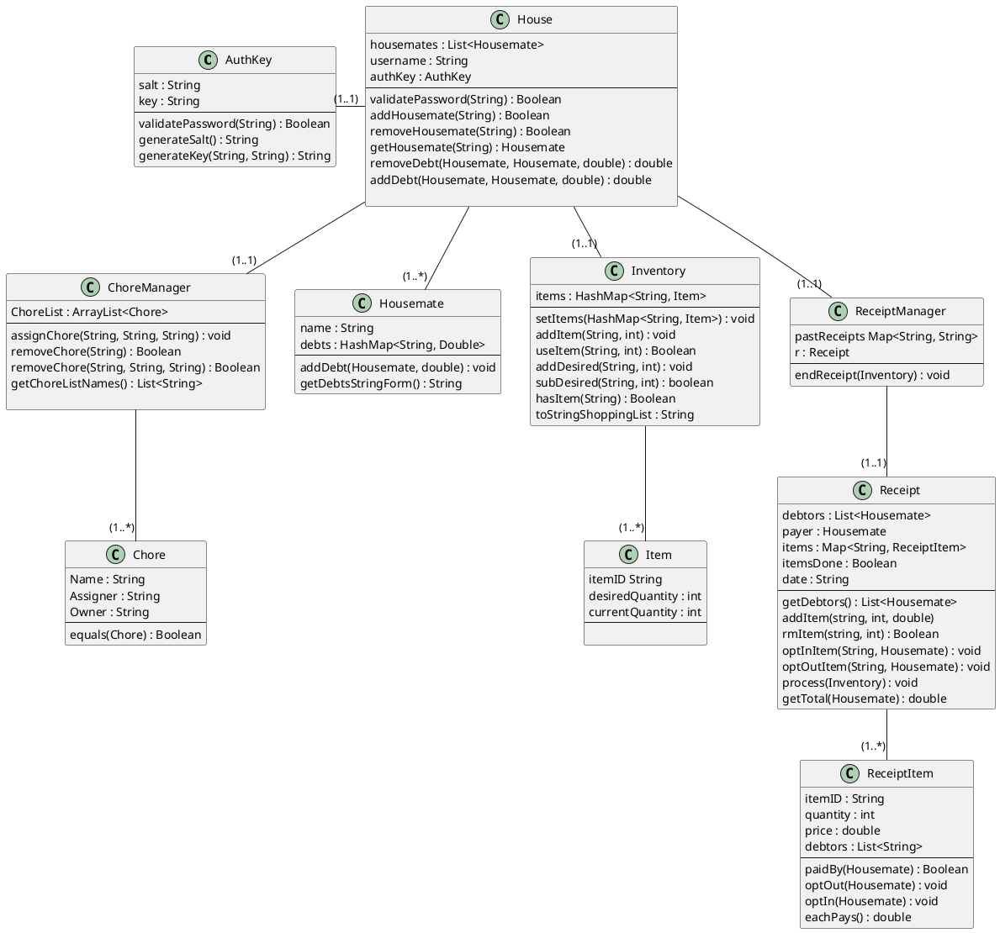

#Domain Model:

#Sequence Diagram For Creating A Receipt

```plantuml

 'Sequence Diagram
 
 hide footbox

participant " : Housemate" as Housemate
participant " : ReceiptManager" as ReceiptManager
participant " : Receipt" as Receipt
participant " : Inventory" as Inventory


ReceiptManager -> Receipt : startReceipt()
ReceiptManager -> Receipt : addItem()
ReceiptManager -> Receipt : removeItem()
ReceiptManager -> Receipt : itemsDone()
ReceiptManager -> Receipt : endReceipt()
Receipt -> Inventory : process()
Receipt -> Housemate : addDebt()
Inventory -> Inventory : addItem()
Inventory <- Inventory : removeItem()

```


#Sequence Diagram for Editing Inventory/Shopping List
```plantuml

 'Sequence Diagram
 
 hide footbox

participant " : Inventory" as Inventory
participant " : ShoppingList" as ShoppingList
participant " : Item" as Item


Inventory -> Inventory : addItem()
Inventory <- Inventory : removeItem()
Inventory -> ShoppingList : getShoppingList()
ShoppingList -> Item : subDesired()
ShoppingList -> Item : addDesired()


```
#Sequence Diagram for Editing Chore List
```plantuml

 'Sequence Diagram
 
 hide footbox

participant " : ChoreManager" as ChoreManager
participant " : Chore" as Chore
participant " : Housemate1" as Housemate1
participant " : Housemate2" as Housemate2


ChoreManager -> Chore : new Chore()
Chore -> Housemate1 : setAssigner();
Chore -> Housemate2 : setOwner();
ChoreManager -> Chore : removeChore()


```

#Sequence Diagram for Editing Debts
```plantuml

 'Sequence Diagram
 
hide footbox

participant " : Housemate1" as Housemate1 
participant " : Housemate2" as Housemate2


Housemate1 -> Housemate2 : addDebt()
Housemate1 -> Housemate2 : removeDebt()


```

#Sequence Diagram for Firebase Communication
```plantuml

 'Sequence Diagram
 
hide footbox

participant " : House" as House
participant " : ReceiptManager" as ReceiptManager
participant " : FirestoreFacade" as FirestoreFacade 
participant " : ChoreManager" as ChoreManager
participant " : Inventory" as Inventory

FirestoreFacade -> House : createHouseIfNotExists()
FirestoreFacade -> House : setHouse()
FirestoreFacade -> House : retrieveHouse()
FirestoreFacade -> ReceiptManager : setReceipts()
FirestoreFacade -> ReceiptManager : retrieveReceipts()
FirestoreFacade -> ChoreManager : setChore()
FirestoreFacade -> ChoreManager : retreiveChore()
FirestoreFacade -> Inventory : setInven()
FirestoreFacade -> Inventory : retrieveInven()
FirestoreFacade -> FirestoreFacade : set()


```


#Class Diagram:

